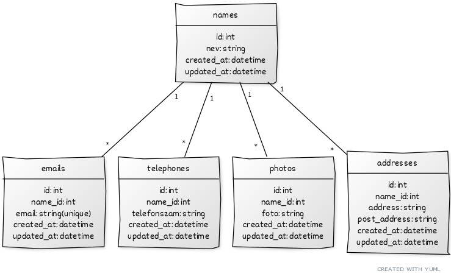

# Névjegykezelő Rendszer

Ez a projekt egy egyszerű névjegykezelő rendszer, amely lehetővé teszi felhasználók neveinek, elérhetőségeinek, fotóinak és címeinek nyilvántartását. A rendszer funkciói a következők:

## Funkciók

1. **Nevek kezelése:**
   - Létrehozás, módosítás és törlés lehetősége a nevekkel kapcsolatban.

2. **Email címek hozzárendelése:**
   - Korlátlan számú email cím hozzárendelése egy névhez.
   - Egyedi email címek biztosítása, hogy csak egyszer szerepeljenek a rendszerben.

3. **Telefonszámok tárolása:**
   - Korlátlan számú telefonszám hozzárendelése egy névhez.

4. **Fotók csatolása:**
   - Lehetőség a névhez tartozó fotó csatolására.

5. **Lakcím és levelezési cím megadása:**
   - Lehetőség a névhez tartozó lakcím és levelezési cím megadására.
   - Amennyiben ugyanaz, csak egyszer kell megadni.

## Használat

1. **Nevek kezelése:**
   - Az alkalmazásban lehetőség van új nevek létrehozására, meglévő nevek módosítására és nevek törlésére.

2. **Email címek kezelése:**
   - Minden névhez tartozhat korlátlan számú email cím.
   - Az email címek egyediek, csak egyszer szerepelhetnek a rendszerben.

3. **Telefonszámok hozzárendelése:**
   - Opcionálisan adhat hozzá telefonszámokat a nevekhez.

4. **Fotók kezelése:**
   - Lehetőség van a névhez tartozó fotók csatolására.

5. **Címek megadása:**
   - Adja meg a lakcímet és a levelezési címet, ha különböznek, csak egyszer kell megadni.

## Telepítés

1. Klónozza le a projektet: `git clone https://github.com/Bogdan-Erik/netipar-php`
2. Nyissa meg a projekt mappáját: `cd netipar-php`
3. Telepítse a szükséges függőségeket: `composer install`, `npm install` vagy `yarn install`
4. Indítsa el az alkalmazást: `sail up -d`, `npm start` vagy `yarn start`

## Követelmények

- Node.js
- npm vagy Yarn

## Licensz

Ez a projekt a [MIT licensz](LICENSE) alatt áll.

---
